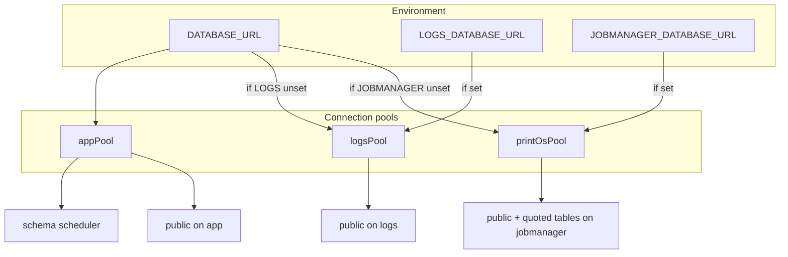
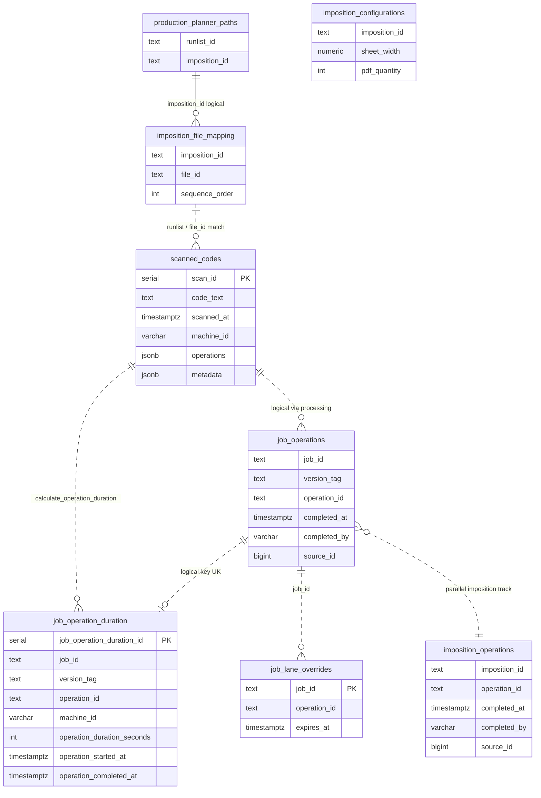
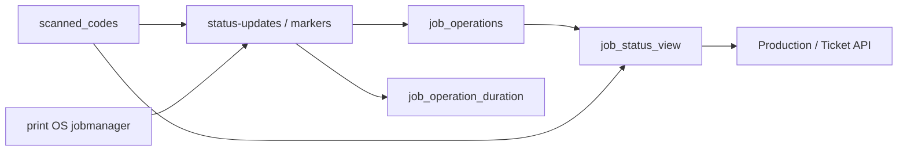
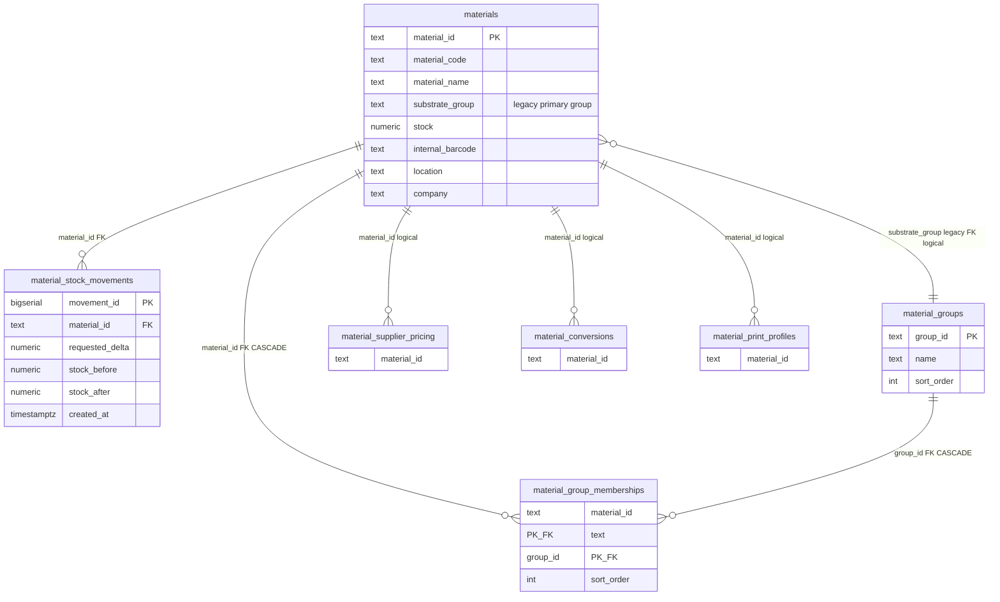
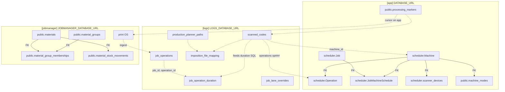

# Database ERD — potential-potato

Documentation for building an [Eraser.io](https://www.eraser.io) ERD. All databases are **PostgreSQL**. Table names match production SQL/Prisma identifiers (quoted where required).

## Legend

| Line style | Meaning |
|------------|---------|
| **Solid** | Enforced `FOREIGN KEY` in migrations or Prisma |
| **Dashed** | Logical / application join (no DB constraint) |
| **Tag `[app]`** | `DATABASE_URL` app pool |
| **Tag `[logs]`** | `LOGS_DATABASE_URL` logs pool (or `DATABASE_URL` when unset) |
| **Tag `[jobmanager]`** | `JOBMANAGER_DATABASE_URL` print-os pool (or app pool when unset) |

---

## 1. Database catalog

| Pool | Env var | Config | Typical contents |
|------|---------|--------|------------------|
| **App** | `DATABASE_URL` (or `APP_DB_*`) | [`server/db/database-config.ts`](../server/db/database-config.ts) `getAppDatabaseUrl()` | Prisma `scheduler` schema, `public.machine_modes`, `public.processing_markers`, optional `public.jobs` |
| **Logs** | `LOGS_DATABASE_URL` (or `LOGS_DB_*`, else falls back to `DATABASE_URL`) | `getLogsDatabaseUrl()` | `scanned_codes`, `job_operation_duration`, pipeline tables/views, planner tables (dual-DB default) |
| **Jobmanager / Print OS** | `JOBMANAGER_DATABASE_URL` (optional) | `getPrintOsDatabaseUrl()` → [`print-os-pool.ts`](../server/db/print-os-pool.ts) | `"print OS"`, `public.materials`, stock tables, Printbeat/Bladerunner live tables |

### Single-DB vs dual-DB



| Mode | Condition | Effect on ERD |
|------|-----------|---------------|
| **Single-DB** | `LOGS_DATABASE_URL` unset | `[app]` and `[logs]` tables coexist in one database; draw one container. |
| **Dual-DB** | `LOGS_DATABASE_URL` ≠ `DATABASE_URL` | Pipeline + planner on `[logs]`; scheduler + markers on `[app]`. Do **not** draw FK lines across containers. |
| **Split Print OS** | `JOBMANAGER_DATABASE_URL` set | Materials + `"print OS"` on `[jobmanager]`; `processing_markers` stays on `[app]`. |

Migrations are routed in [`server/db/run-migrations.ts`](../server/db/run-migrations.ts) (`pipelineMigrationTarget()`, per-file `logs` / `app` / print-os pool).

### Module → pool → tables

| Module | API / code | Primary pool |
|--------|------------|--------------|
| Scheduler UI, config | `server/scheduler-api.ts`, Prisma | App |
| Production / ticket / scans | `server/db/jobmanager-queries.ts`, `status-updates.ts` | Logs (+ app for scheduler catalog) |
| Planner / runlists | `server/db/planner-client.ts` | Logs (dual-DB); `imposition_file_mapping` **logs only** |
| Stock | `server/stock-api.ts` | Jobmanager pool (`getPrintOsPool()`) |
| Analytics | `server/analytics-api.ts`, `analytics-ontime.ts` | Logs + jobmanager `public.jobs` (cross-DB logical) |
| Print OS ingest | `status-updates.ts`, `processing_markers` | Read `"print OS"` from jobmanager; cursor on app |

---

## 2. Diagram A — Scheduler `[app]`

Prisma models live in schema **`scheduler`** ([`prisma/schema.prisma`](../prisma/schema.prisma)).

```mermaid
erDiagram
  scheduler_Machine ||--o{ scheduler_Operation : "machineId FK CASCADE"
  scheduler_Operation ||--o{ scheduler_OperationParam : "operationId FK CASCADE"
  scheduler_Operation ||--o| scheduler_BatchRule : "operationId FK UNIQUE CASCADE"
  scheduler_Operation ||--o{ scheduler_MaterialOverride : "operationId FK CASCADE"
  scheduler_Operation ||--o{ scheduler_OperationDependency : "operationId FK CASCADE"
  scheduler_Connector ||--o{ scheduler_Job : "connectorId FK SET NULL"
  scheduler_Job ||--o{ scheduler_JobMachineSchedule : "jobId FK CASCADE"
  scheduler_Machine ||--o{ scheduler_JobMachineSchedule : "machineId FK CASCADE"
  scheduler_Machine ||--o{ scheduler_scanner_devices : "machine_id FK SET NULL"
  scheduler_Machine ||--o{ public_machine_modes : "machine_id FK CASCADE"

  scheduler_Machine {
    text id PK
    text name UK
    text displayName
    boolean enabled
    int sortOrder
    json constants
  }

  scheduler_Operation {
    text id PK
    text machineId FK
    text operation_id "planner op###"
    text name
    text type
    int sortOrder
  }

  scheduler_OperationParam {
    text id PK
    text operationId FK
    text key
    json value
  }

  scheduler_BatchRule {
    text id PK
    text operationId FK UK
    text scope
  }

  scheduler_MaterialOverride {
    text id PK
    text operationId FK
    text materialKey
    text paramKey
  }

  scheduler_OperationDependency {
    text id PK
    text operationId FK
    text requiresParam
    text requiresValue
  }

  scheduler_Connector {
    text id PK
    text name
    text type
    json config
  }

  scheduler_TimeEstimatorSettings {
    text id PK
    text key UK
    json flowProperties
  }

  scheduler_Job {
    text id PK
    text connectorId FK
    text material
    text productionPath
    datetime dueDate
    json switchEstimateOutput
  }

  scheduler_JobMachineSchedule {
    text id PK
    text jobId FK
    text machineId FK
    datetime scheduledDate
  }

  scheduler_scanner_devices {
    text device_id PK
    text machine_id FK
    text mode_id "no FK"
    text operation_id "no FK"
    timestamptz last_seen_at
  }

  public_machine_modes {
    serial mode_id PK
    text machine_id FK
    text label
    text_array operation_ids
  }
```

### SQL table names (Eraser entities)

| Entity label | Physical table |
|--------------|----------------|
| `scheduler_Machine` | `scheduler."Machine"` |
| `scheduler_Operation` | `scheduler."Operation"` (column `operation_id` = planner id) |
| `scheduler_OperationParam` | `scheduler."OperationParam"` |
| `scheduler_BatchRule` | `scheduler."BatchRule"` |
| `scheduler_MaterialOverride` | `scheduler."MaterialOverride"` |
| `scheduler_OperationDependency` | `scheduler."OperationDependency"` |
| `scheduler_Connector` | `scheduler."Connector"` |
| `scheduler_TimeEstimatorSettings` | `scheduler."TimeEstimatorSettings"` |
| `scheduler_Job` | `scheduler."Job"` |
| `scheduler_JobMachineSchedule` | `scheduler."JobMachineSchedule"` |
| `scheduler_scanner_devices` | `scheduler.scanner_devices` |
| `public_machine_modes` | `public.machine_modes` |

### Dashed (logical) links on Diagram A

| From | To | Notes |
|------|-----|-------|
| `scheduler.scanner_devices.operation_id` | `scheduler."Operation".operation_id` | Catalog reference (`op###`), not Prisma FK |
| `scheduler.scanner_devices.mode_id` | `public.machine_modes.mode_id` | Preset bundle id |
| `scheduler."Operation".operation_id` | `imposition_operations.operation_id` / pipeline | Cross-schema, cross-DB in dual-DB mode |

---

## 3. Diagram B — Pipeline & status `[logs]` (+ planner)

When dual-DB, these tables target **logs** ([`pipelineMigrationTarget()`](../server/db/run-migrations.ts)). In single-DB they share the app database but remain conceptually the pipeline domain.



### Views (derive from tables; no FK)

| View | Purpose |
|------|---------|
| `job_status_view` | Latest operation + derived status per `job_id` |
| `job_status_runlist_view` | Runlist-oriented status aggregation |
| `job_operations_with_duration` | `job_operations` + `job_operation_duration` + calc from scans |

### App-only pipeline support `[app]`

| Table | PK | Role |
|-------|-----|------|
| `public.processing_markers` | `marker_id` | Cursor for `print_os` / `scanned_codes` ingest (`marker_type`, `last_processed_id`) |

### Dashed cross-domain links (Diagram B)

| From | To | Join key |
|------|-----|----------|
| `scanned_codes.machine_id` | `scheduler."Machine".id` | VARCHAR press id from scan time |
| `job_operation_duration.machine_id` | `scheduler."Machine".id` | Same |
| `job_operations` | `scanned_codes` | `completed_by='scanner'`, `source_id = scan_id` |
| `job_operations` | `"print OS"` `[jobmanager]` | `completed_by='print_os'`, `source_id = print OS.id` |
| `has_scanned_operation()` | planner tables | `code_text` ↔ `runlist_id` / `file_id` patterns |
| `scheduler."Job"` | pipeline `job_id` | **No FK** — scheduler jobs are estimator/calendar copies, not logs job ids |

### Status flow (for Eraser notes)



---

## 4. Diagram C — Materials & stock `[jobmanager]` (or app if unset)

Stock API uses `getPrintOsPool()` ([`server/stock-api.ts`](../server/stock-api.ts)). Migrations `038`–`041` run on **both** app and jobmanager when `materials` exists.



### Legacy / external tables on jobmanager (document as nodes, dashed links)

| Table | Tag | Link |
|-------|-----|------|
| `"print OS"` | `[jobmanager]` | `processing_markers` on app; `job_operations.source_id` when `completed_by='print_os'` |
| `public.jobs` | `[jobmanager]` optional | Analytics on-time; optional notes on impositions |
| `Printbeat data Real time` | `[jobmanager]` env-named | Production status enrich (no migration FK) |
| `Bladerunner cutter live` | `[jobmanager]` env-named | Digital cutter live signal |

---

## 5. Overview — how the three domains connect

Use this as the **cover sheet** in Eraser; keep FK lines only inside each subgraph.



---

## 6. Eraser.io import checklist

1. Create **three diagrams** (Scheduler, Pipeline, Materials) plus optional Overview.
2. For each entity, set **schema** attribute: `scheduler`, `public`, or quoted `"print OS"`.
3. Copy solid relationships from sections 2–4; add dashed style for section tables marked *Dashed*.
4. Add a **sticky note** on dual-DB deployments: “No cross-database FKs — only logical joins in TypeScript/SQL.”
5. Optional fourth page: **Appendix** for `TimeEstimatorSettings`, views, and env-specific live tables.

### Suggested Eraser entity naming

Use `schema.table` labels to avoid Prisma/PG casing confusion:

- `scheduler.Machine` not `Machine`
- `scheduler.scanner_devices` (snake_case table)
- `public.materials`
- `"print OS"` (include quotes in display name or alias `print_os`)

---

## 7. Relation index (FK vs logical)

| # | From | To | Type | DB boundary |
|---|------|-----|------|-------------|
| 1 | `scheduler.Operation.machineId` | `scheduler.Machine.id` | **FK** CASCADE | app |
| 2 | `scheduler.OperationParam.operationId` | `scheduler.Operation.id` | **FK** CASCADE | app |
| 3 | `scheduler.BatchRule.operationId` | `scheduler.Operation.id` | **FK** CASCADE | app |
| 4 | `scheduler.MaterialOverride.operationId` | `scheduler.Operation.id` | **FK** CASCADE | app |
| 5 | `scheduler.OperationDependency.operationId` | `scheduler.Operation.id` | **FK** CASCADE | app |
| 6 | `scheduler.Job.connectorId` | `scheduler.Connector.id` | **FK** SET NULL | app |
| 7 | `scheduler.JobMachineSchedule.jobId` | `scheduler.Job.id` | **FK** CASCADE | app |
| 8 | `scheduler.JobMachineSchedule.machineId` | `scheduler.Machine.id` | **FK** CASCADE | app |
| 9 | `scheduler.scanner_devices.machine_id` | `scheduler.Machine.id` | **FK** SET NULL | app |
| 10 | `public.machine_modes.machine_id` | `scheduler.Machine.id` | **FK** CASCADE | app |
| 11 | `public.material_stock_movements.material_id` | `public.materials.material_id` | **FK** | jobmanager/app |
| 12 | `material_group_memberships.material_id` | `public.materials.material_id` | **FK** CASCADE | jobmanager/app |
| 13 | `material_group_memberships.group_id` | `public.material_groups.group_id` | **FK** CASCADE | jobmanager/app |
| 14 | `job_operation_duration` | `job_operations` | **Logical** UNIQUE `(job_id, version_tag, operation_id)` | logs |
| 15 | `scanned_codes` | `job_operations` | **Logical** via ingest + `source_id` | logs / cross |
| 16 | `scanned_codes.machine_id` | `scheduler.Machine.id` | **Logical** | cross |
| 17 | `scanner_devices.operation_id` | `scheduler.Operation.operation_id` | **Logical** | app |
| 18 | `scanner_devices.mode_id` | `machine_modes.mode_id` | **Logical** | app |
| 19 | `production_planner_paths` | `imposition_file_mapping` | **Logical** `imposition_id` | logs |
| 20 | `public.jobs` | `job_operation_duration` | **Logical** analytics bridge | cross |
| 21 | `"print OS"` | `job_operations` | **Logical** ingest | cross |
| 22 | `scheduler.Job` | pipeline `job_id` | **Logical** / separate domains | cross |

---

## Source files

| Topic | Path |
|-------|------|
| Prisma schema | [`prisma/schema.prisma`](../prisma/schema.prisma) |
| DB URLs | [`server/db/database-config.ts`](../server/db/database-config.ts) |
| Migrations | [`server/db/migrations/`](../server/db/migrations/) |
| Jobmanager-only SQL | [`server/db/migrations-jobmanager/`](../server/db/migrations-jobmanager/) |
| Env template | [`.env.example`](../.env.example) |
